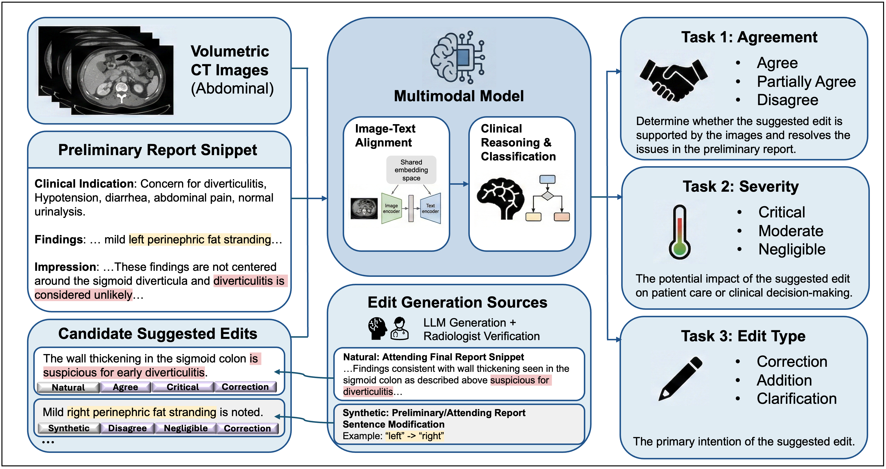

# RADAR: A Multimodal Benchmark for 3D Image-Based Radiology Report Review

<p align="center">
  
</p>

**RADAR** is a multimodal benchmark for radiology report discrepancy analysis. It pairs 3D abdominal CT examinations with preliminary radiology reports and candidate edits, requiring models to reason about image-text alignment and clinical significance at the report review stage.

> **Paper:** [RADAR: A Multimodal Benchmark for 3D Image-Based Radiology Report Review](https://arxiv.org/abs/2603.06681) — Zhaoyi Sun, Minal Jagtiani, Wen-wai Yim, Fei Xia, Martin Gunn, Meliha Yetisgen, Asma Ben Abacha. *arXiv:2603.06681 [cs.CV], March 2026.*

> **Shared Task:** [ImageCLEFmed MEDIQA-CORE 2026 — Task 2: Report Discrepancy Summarization](https://ai4media-bench.aimultimedialab.ro/competitions/7/#overview/page/2)

---

## Overview

Radiology reports for the same patient examination can contain clinically meaningful discrepancies arising from interpretation differences, reporting variability, or evolving assessments. Systematic analysis of these discrepancies is important for quality assurance and clinical decision support, yet has been limited by the lack of standardized benchmarks.

RADAR reflects a standard clinical workflow where trainee radiologists author **preliminary reports** that are subsequently reviewed and revised by attending radiologists. The benchmark defines a structured **discrepancy assessment task** requiring models to evaluate proposed report edits along three dimensions:

| Label | Values |
|---|---|
| **Agreement** | `agree` / `partially agree` / `disagree` |
| **Severity** | `negligible` / `moderate` / `critical` |
| **Edit type** | `addition` / `correction` / `clarification` |

Unlike prior work emphasizing binary error detection or comparison against fully independent reference reports, RADAR targets **fine-grained clinical reasoning** and **image-text alignment** at the report review stage.

---

## Paper

**[RADAR: A Multimodal Benchmark for 3D Image-Based Radiology Report Review](https://arxiv.org/abs/2603.06681)**  
Zhaoyi Sun, Minal Jagtiani, Wen-wai Yim, Fei Xia, Martin Gunn, Meliha Yetisgen, Asma Ben Abacha  
arXiv:2603.06681 [cs.CV] — Submitted March 4, 2026

The paper presents the RADAR dataset, task formulation, expert annotation methodology, evaluation protocol, and baseline multimodal model experiments. A preprint PDF is included in [`assets/manuscript.pdf`](assets/manuscript.pdf).

---

## Shared Task: ImageCLEFmed MEDIQA-CORE 2026

The RADAR dataset is also the foundation of **Task 2: Report Discrepancy Summarization** in the [ImageCLEFmed MEDIQA-CORE 2026](https://ai4media-bench.aimultimedialab.ro/competitions/7/#overview/page/2) shared task, organized by Microsoft and University of Washington.


- **Platform:** [AI4MediaBench](https://ai4media-bench.aimultimedialab.ro/competitions/7/)
- **Task:** ImageCLEFmed MEDIQA-CORE 2026, Task 2 [Website](https://www.imageclef.org/2026/medical/mediqa-core) 
- **Organizers:** Asma Ben Abacha, Zhaoyi Sun, Wen-wai Yim, Fei Xia and Meliha Yetisgen

---

## Repository Structure

```
RADAR/
├── assets/
│   ├── figure_1.png          # Overview figure from the paper
│   └── manuscript.pdf        # Full paper PDF
├── baselines/
│   ├── gemini_video.ipynb    # Gemini baseline: CT volume as video
│   ├── gemini_slice.ipynb    # Gemini baseline: CT slices as images
│   ├── qwen_video.ipynb      # Qwen baseline: CT volume as video
│   └── qwen_slice.ipynb      # Qwen baseline: CT slices as images
├── data/
│   ├── example_edits.json              # Example candidate edits (2 cases)
│   └── example_preliminary_report/    # Example preliminary reports (2 cases)
├── eval/
│   ├── eval.py                   # Official evaluation script
│   ├── eval.sh                   # Convenience shell wrapper
│   ├── groundtruth_dev.csv       # Ground-truth labels for the dev set
│   ├── example_submission.csv    # Example submission format
│   └── example_eval_results.json # Example output from eval.py
└── tools/
    ├── view_dicom_metadata.py        # Extract and summarize DICOM metadata
    ├── retrieve_series.py            # LLM-based series selection per edit
    └── metadata_dev_all_series.csv   # Precomputed series metadata for dev set
```

---

## Task Definition

For each case, the model receives:
1. A **3D abdominal CT image** (one or more DICOM series)
2. A **preliminary radiology report** authored by a trainee radiologist
3. A **candidate edit** proposed by an attending radiologist

The model must predict three labels for each edit:

- **Agreement** — Does the CT image support the edit? (`agree` / `partially agree` / `disagree`)
- **Severity** — How clinically significant is the underlying discrepancy? (`negligible` / `moderate` / `critical`)
- **Edit type** — What kind of change does the edit represent? (`addition` / `correction` / `clarification`)

---

## Evaluation

Performance on the dev set is measured by four metrics:

| Metric | Description |
|---|---|
| **Agreement accuracy** | Exact-match accuracy on the agreement label (`agree`, `partially agree`, and `disagree` are treated as distinct classes) |
| **Severity accuracy** | Exact-match accuracy on the severity label |
| **Edit type accuracy** | Exact-match accuracy on the edit type label |
| **Composite score** | Fraction of examples where the agreement fuzzy-matches *and* both severity and edit type exactly match. |

See [`eval/`](eval/) for the evaluation script and submission format details.

---

## Dataset

The example files in this folder are provided for reference only. The full RADAR dataset contains 50 de-identified cases and is subject to a Data Use Agreement (DUA). To request access to the full dataset, please contact: zhaoyis [at] uw.edu and melihay [at] uw.edu

Your request should include your name, institutional affiliation, and a brief description of your intended use. A signed DUA is required before data will be released.

Participants in the ImageCLEFmed MEDIQA-CORE 2026 shared task may access the dataset through the official competition platform.

---

## Baselines

Four baseline notebooks are provided in [`baselines/`](baselines/), covering two models (Gemini, Qwen) and two image input strategies (per-slice images, volumetric video). See the baselines README for setup and usage.

---

## License and Citation

This work is released under the Creative Commons Attribution 4.0 International License (CC BY 4.0). Please cite our paper if you use the RADAR dataset or framework:

```bibtex
@article{sun2026radar,
  title     = {RADAR: A Multimodal Benchmark for 3D Image-Based Radiology Report Review},
  author    = {Sun, Zhaoyi and Jagtiani, Minal and Yim, Wen-wai and Xia, Fei and Gunn, Martin and Yetisgen, Meliha and Ben Abacha, Asma},
  journal   = {arXiv preprint arXiv:2603.06681},
  year      = {2026}
}
```

Contact
=================
    - Zhaoyi Sun (zhaoyis [at] uw.edu)
    - Meliha Yetisgen (melihay [at] uw.edu)
    - Asma Ben abacha (abenabacha [at] microsoft.com)
----
